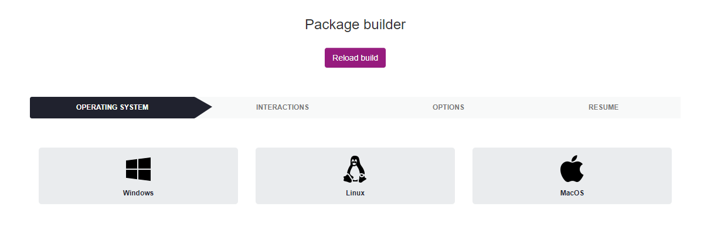

# Introduction to OCS Deployment

OCS Inventory have the capability to deployment softwares when agent are properly configured. This feature gives you a simple and efficient to manage software installation / update and script execution on the remote machine.

`This` [pre-requisites](Prerequisites.md) `and` [configuration](Configuration.md)`  won't be discussed in this chapter, refer to corresponding chapter for more info.`

## How does it work ?

Stating from 2.9, OCS Inventory use a template system in order to provide a more user-friendly user interface. 

The deployment is composed in four different step : 
* Operating system : Target operating system selection 
* Interactions : Action to be performed on the remote system
* Options : Depending on the selected interation, a list of the required information to create the package
* Resume : Summary of the created package

The generated packages will be constitued of an info file containing a list of actions to perform on the remote system.

In the case you install a software for example, the executable / setup of the software will be stored in a zip format. Depending on its size, it will be fragment in multiple part to avoid to stress the network during the deployment.

## Accessing the deployment wizard

You can access the deployment wizard by clicking on the `Deployment > Build` menu.

Then click on the targeted operating system.

