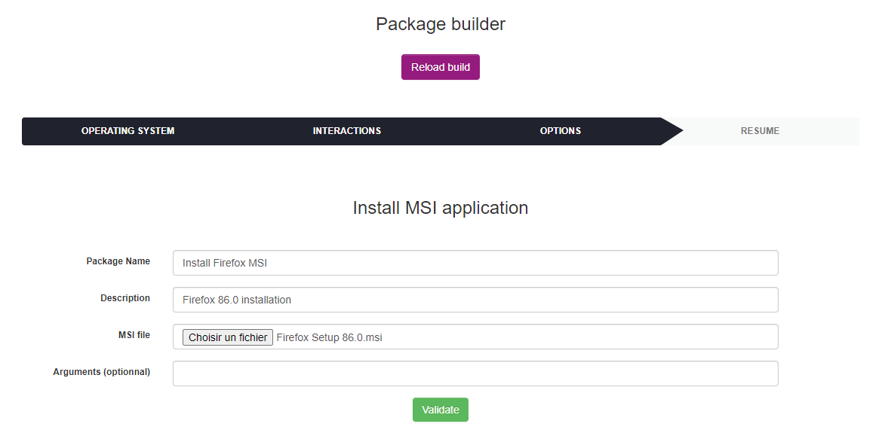

# Windows deployment templates

## Summary

### Install / Uninstall

* [Install MSI application](#install-msi-application)
* [Update Windows Agent](#update-windows-agent)
* [Execute an exe](#execute-an-exe)
* [Uninstall application](#uninstall-application)

### Scripts

* [Powershell script](#powershell-script)
* [Batch script](#batch-script)

### Others

* [Store file or folder](#store-file-or-folder)
* [Custom package](#custom-package)


## Install MSI application

To install MSI application, go to ```Deployment > Build > Windows > Install / Uninstall``` and click on ```Install MSI application```.



List of MSI installation's form parameters :

* **Package Name** : the package display name
* **Description** : the package description
* **MSI file** : MSI file to be deployed
* **Arguments** : MSI command line arguments (optionnal)

Below, the list of default MSI installation's parameters (not configurable by the user):

* **Priority** : 5
* **Action** : Execute
* **Protocole** : HTTP
* **Command** : msiexec /i application.msi {custom arguments}
* **Notify User** : No
* **Notify can abort** : No
* **Notify can delay** : No
* **Need done action** : No

Next, click on ```Validate```. After the package has been created its resume is displayed.


