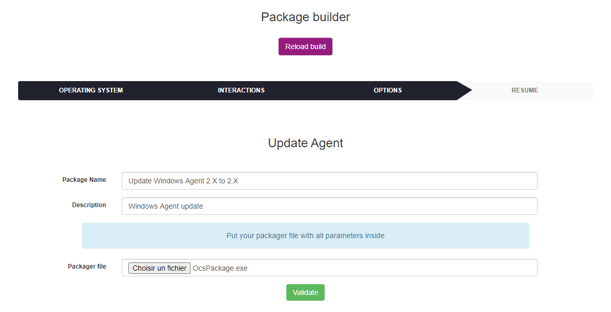
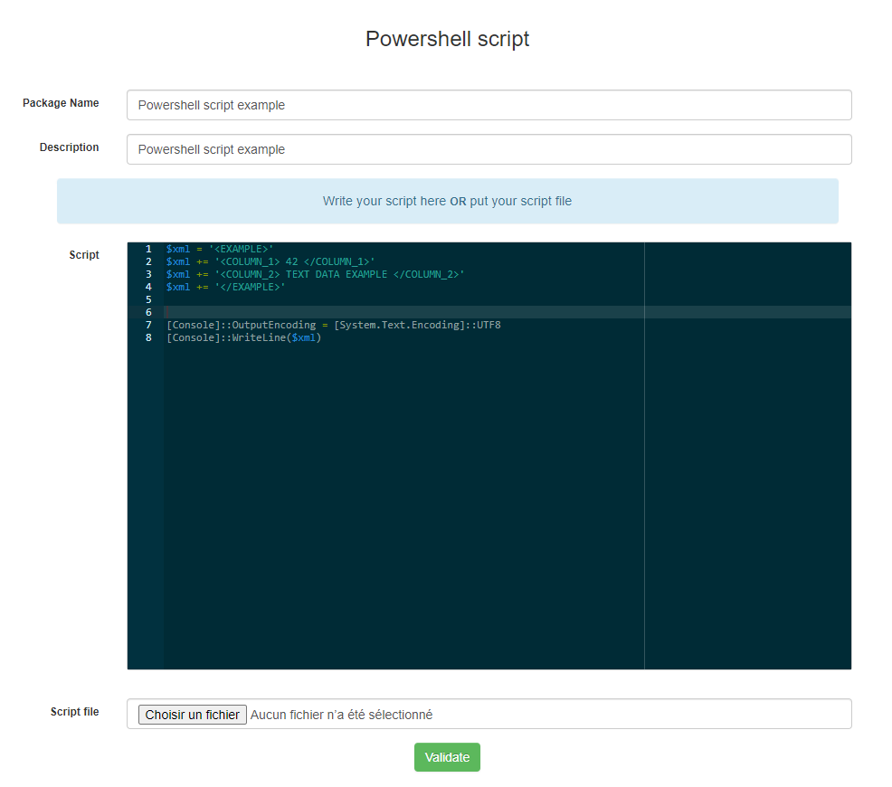
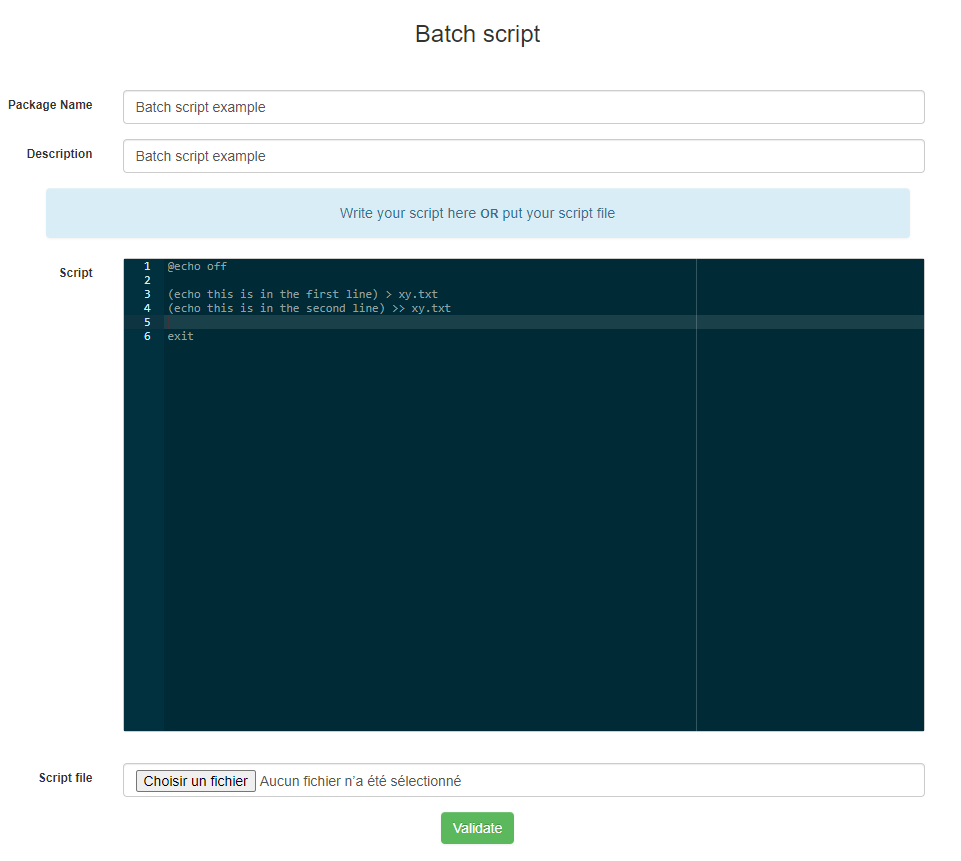
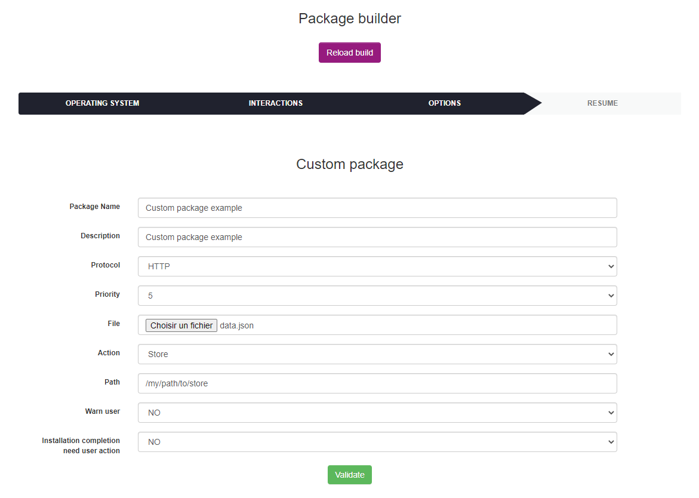

# Windows deployment templates

## Summary

### Install / Uninstall

* [Install MSI application](#install-msi-application)
* [Update Windows Agent](#update-windows-agent)
* [Execute an exe](#execute-an-exe)
* [Uninstall application](#uninstall-application)

### Scripts

* [Powershell script](#powershell-script)
* [Batch script](#batch-script)

### Others

* [Store file/folder](#store-file-or-folder)
* [Custom package](#custom-package)

## Install MSI application

To install MSI application, go to `Deployment > Build > Windows > Install / Uninstall` and click on `Install MSI application`.

List of MSI installation's form parameters :

* **Package Name** : the package display name
* **Description** : the package description
* **MSI file** : MSI file to be deployed
* **Arguments** : MSI command line arguments (optionnal)

Below the list of default MSI installation's parameters (not configurable by the user):

* **Priority** : 5
* **Action** : Execute
* **Protocole** : HTTP
* **Command** : msiexec /i application.msi {custom arguments}
* **Notify User** : No
* **Notify can abort** : No
* **Notify can delay** : No
* **Need done action** : No

Next, click on `Validate`. After the package has been created its resume is displayed.

The fragments number and the Activated column value depends on your deployment configuration. For more informations see [Deployment configuration](../Configuration.md).

## Update Windows Agent

`Note : To create update package, you need to create a Windows Agent setup with OCS Packager and all command line parameters inside before. For more informations, read` [Use OCSPackager](../Configuration.md) `documentation.`

To update Windows Agent, go to `Deployment > Build > Windows > Install / Uninstall` and click on `Update Agent`.

List of Update agent's form parameters :

* **Package Name** : the package display name
* **Description** : the package description
* **Packager file** : OCS Agent setup generate by OCS Packager

Below the list of default Update agent's parameters (not configurable by the user):

* **Priority** : 5
* **Action** : Execute
* **Protocole** : HTTP
* **Command** : powershell.exe -File scheduledupdateagent.ps1
* **Notify User** : No
* **Notify can abort** : No
* **Notify can delay** : No
* **Need done action** : No

Next, click on `Validate`. After the package has been created its resume is displayed.

The fragments number and the Activated column value depends on your deployment configuration. For more informations see [Deployment configuration](../Configuration.md).

`Note : the Update Agent deployment uninstall the old agent to install the new agent properly.`

## Execute an exe

To execute an exe, go to `Deployment > Build > Windows > Install / Uninstall` and click on `Execute an exe`.

List of Execute an exe's form parameters :

* **Package Name** : the package display name
* **Description** : the package description
* **EXE file** : executable file
* **Arguments** : command line arguments (optionnal)
* **Warn user** : warn user before deployment (No by default)
* **Text** : warn user message (Not visible if warn user at No)
* **Countdown** : warn user message coutdown (Not visible if warn user at No)

Below the list of default Execute an exe's parameters (not configurable by the user):

* **Priority** : 5
* **Action** : Launch
* **Protocole** : HTTP
* **Command** : executable.exe {custom arguments}
* **Notify can abort** : No
* **Notify can delay** : No
* **Need done action** : No

Next, click on `Validate`. After the package has been created its resume is displayed.

The fragments number and the Activated column value depends on your deployment configuration. For more informations see [Deployment configuration](../Configuration.md).

## Uninstall application

To uninstall application, go to `Deployment > Build > Windows > Install / Uninstall` and click on `Uninstall application`.

List of Uninstall application's form parameters :

* **Package Name** : the package display name
* **Description** : the package description
* **Application identifier** : application name (to find wmic application name, open a cmd as administrator and run `wmic product get name`)
* **Warn user** : warn user before deployment (No by default)
* **Text** : warn user message (Not visible if warn user at No)
* **Countdown** : warn user message coutdown (Not visible if warn user at No)

Below the list of default Uninstall application's parameters (not configurable by the user):

* **Priority** : 5
* **Action** : Execute
* **Protocole** : HTTP
* **Command** : wmic product where (name='{application identifier}') call uninstall
* **Notify can abort** : No
* **Notify can delay** : No
* **Need done action** : No

Next, click on `Validate`. After the package has been created its resume is displayed.

The fragments number and the Activated column value depends on your deployment configuration. For more informations see [Deployment configuration](../Configuration.md).

`Notice : some application uninstallations might trigger a system reboot.`

## Powershell Script

To create a powershell script package, go to `Deployment > Build > Windows > Scripts` and click on `Powershell script`.

List of Powershell script's form parameters :

* **Package Name** : the package display name
* **Description** : the package description
* **Script** : area to write powershell script
* **Script file** : powershell script file

`Note : if you write script on Script area don't put script file and vice versa.`

Below the list of default Powershell script's parameters (not configurable by the user):

* **Priority** : 5
* **Action** : Execute
* **Protocole** : HTTP
* **Command** : powershell.exe -File psscript.ps1
* **Notify User** : No
* **Notify can abort** : No
* **Notify can delay** : No
* **Need done action** : No

Next, click on `Validate`. After the package has been created its resume is displayed.

The fragments number and the Activated column value depends on your deployment configuration. For more informations see [Deployment configuration](../Configuration.md).

## Batch Script

To create a batch script package, go to `Deployment > Build > Windows > Scripts` and click on `Batch script`.

List of Batch script's form parameters :

* **Package Name** : the package display name
* **Description** : the package description
* **Script** : area to write batch script
* **Script file** : batch script file

`Note : if you write script on Script area don't put script file and vice versa.`

Below the list of default Batch script's parameters (not configurable by the user):

* **Priority** : 5
* **Action** : Execute
* **Protocole** : HTTP
* **Command** : batchscript.bat
* **Notify User** : No
* **Notify can abort** : No
* **Notify can delay** : No
* **Need done action** : No

Next, click on `Validate`. After the package has been created its resume is displayed.

The fragments number and the Activated column value depends on your deployment configuration. For more informations see [Deployment configuration](../Configuration.md).

## Store file or folder

To create a store file/folder package, go to `Deployment > Build > Windows > Others` and click on `Store file/folder`.

List of Store's form parameters :

* **Package Name** : the package display name
* **Description** : the package description
* **Path** : path to store file or folder
* **File** : file or folder to store

`Note : if you want to store multiple files, compress before.`

Below the list of default Batch store's parameters (not configurable by the user):

* **Priority** : 5
* **Action** : Store
* **Protocole** : HTTP
* **Path** : {custom path}
* **Notify User** : No
* **Notify can abort** : No
* **Notify can delay** : No
* **Need done action** : No

Next, click on `Validate`. After the package has been created its resume is displayed.

The fragments number and the Activated column value depends on your deployment configuration. For more informations see [Deployment configuration](../Configuration.md).

## Custom package

To create a custom package go to `Deployment > Build > Windows > Others` and click on `Custom package`.

List of Custom package's form parameters :

* **Package Name** : the package display name
* **Description** : the package description
* **Protocol** : HTTP/HTTPS
* **Priority** : deployment priority
* **File** : file to deploy
* **Action** : Execute/Launch/Store
* **Command/Path** : set the command or the path (depends on selected action)
* **Warn user** : display message before deployment

Next, click on `Validate`. After the package has been created its resume is displayed.

The fragments number and the Activated column value depends on your deployment configuration. For more informations see [Deployment configuration](../Configuration.md).